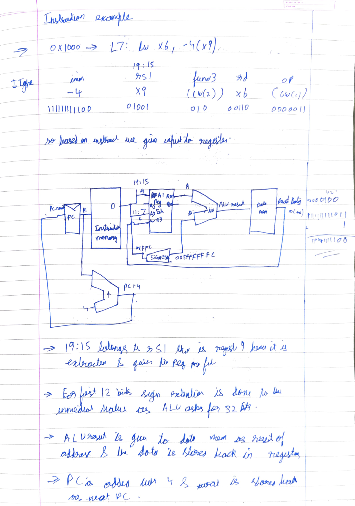
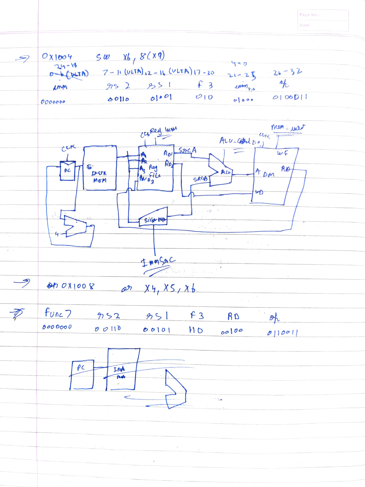
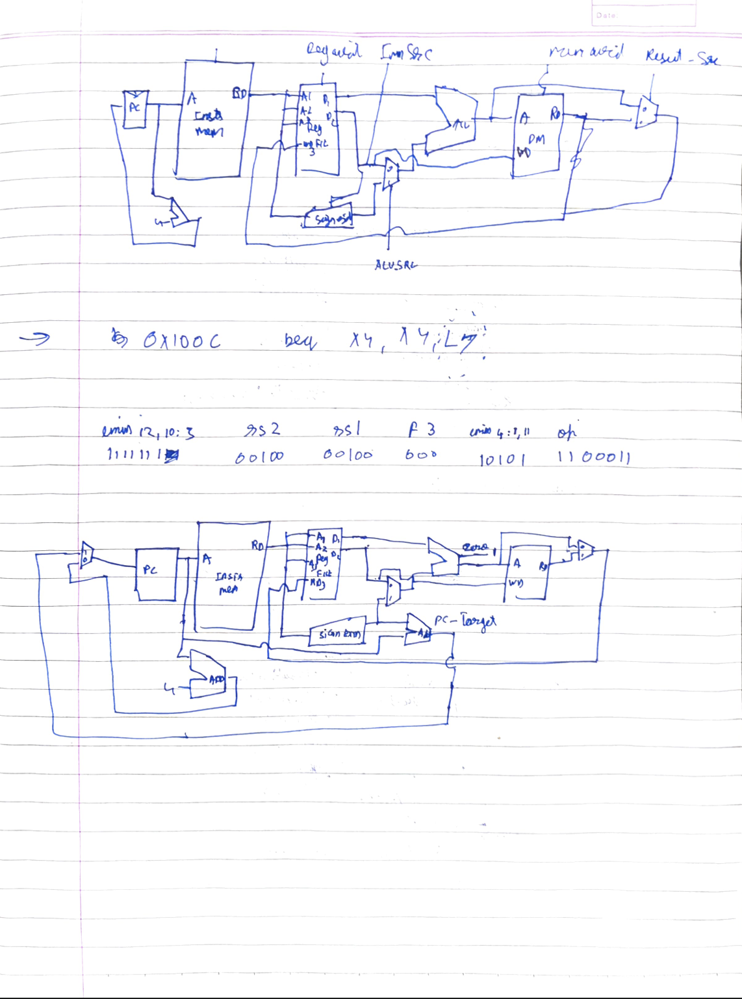
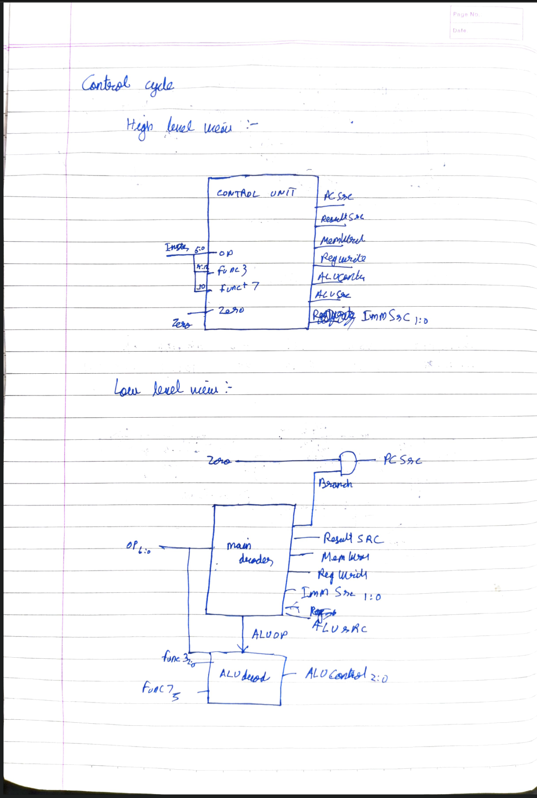
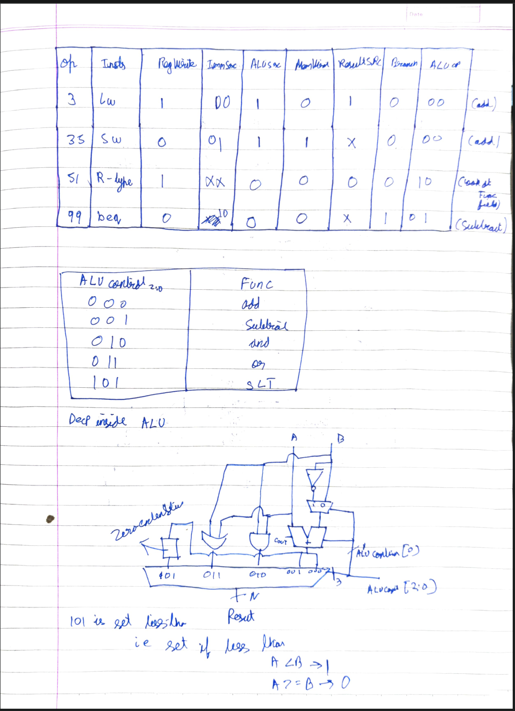
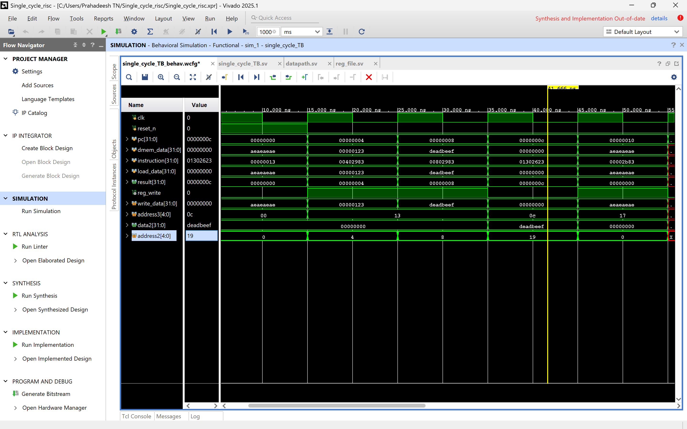
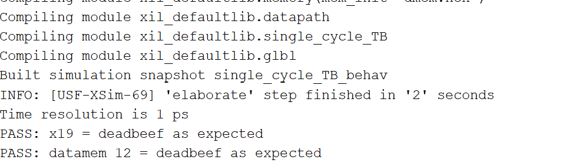

# RM32 — 32-bit RISC-V Processor Core

## 1. Introduction

**RM32** is a custom, single-cycle 32-bit processor core implementing the **RV32I** base integer instruction set of the [RISC-V](https://riscv.org/) open-standard ISA. The entire design is written in **SystemVerilog** and has been validated.

## 3. Architecture Overview

RM32 follows a **single-cycle** microarchitecture. Every instruction is fetched, decoded, executed, and written back within a single clock cycle. The datapath is a combinational network of functional units orchestrated by a centrally-generated control word.

By taking load word's datapath as base i have updated on top of it to include to other instructions.

The project follows the classic textbook single-cycle microarchitecture as its baseline, with each functional block (ALU, Controller, Register File, Memory, Sign-Extension) implemented as a separate, cleanly-interfaced module. My goal here is to just learn about microarchitecture.

## 4. Simulation Output

Load Word simulation - 

(Suceesfully loaded 00000123 and DEADBEEF in register file)

Load and Store Simulation -

TCL console output -

## 5. References

1. **RISC-V Specification** — *The RISC-V Instruction Set Manual, Volume I: Unprivileged ISA, Version 20191213*. RISC-V Foundation. [https://riscv.org/technical/specifications/](https://riscv.org/technical/specifications/)

2. **Harris & Harris** — *Digital Design and Computer Architecture: RISC-V Edition*. Sarah Harris, David Harris. Morgan Kaufmann, 2021.

3. **Xilinx Artix-7 Product Page** — [https://www.xilinx.com/products/silicon-devices/fpga/artix-7.html](https://www.xilinx.com/products/silicon-devices/fpga/artix-7.html)

4. **Xilinx ILA Product Guide** — *PG172 — Integrated Logic Analyzer v6.2*. Xilinx, Inc.

5. **SystemVerilog IEEE Standard** — *IEEE Standard for SystemVerilog — Unified Hardware Design, Specification, and Verification Language*. IEEE Std 1800-2017.

---

  <em>RM32 — Updating the code 1 nanometer at a time</em> 
  <em>Prahadeesh Narendran Thimma · 2026</em>

