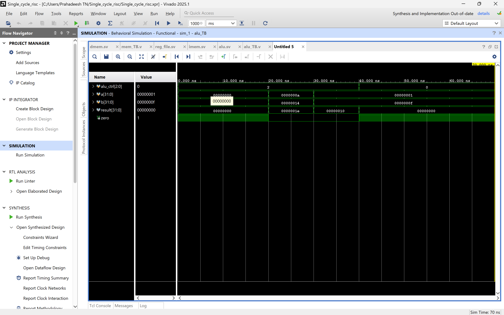
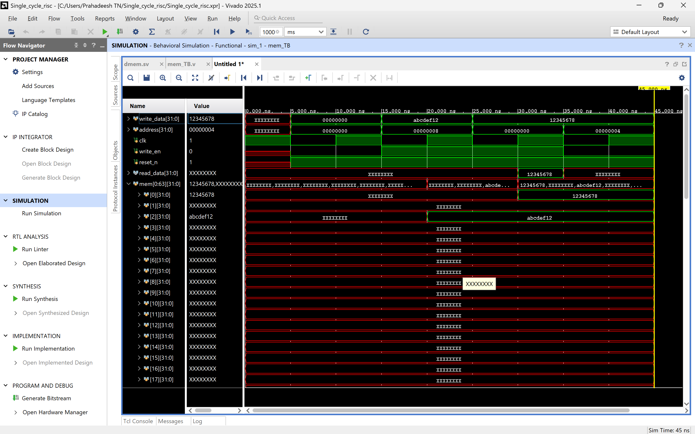
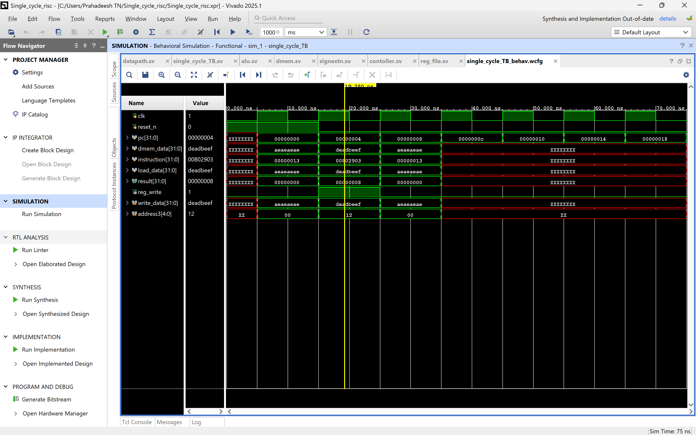
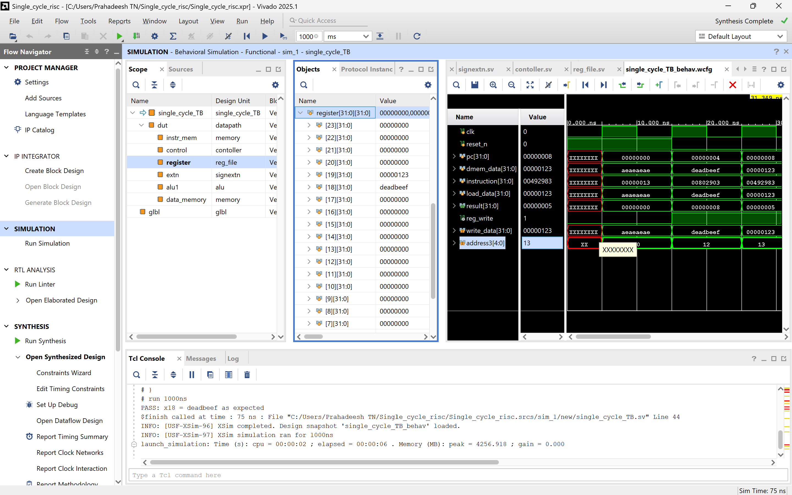

# RM32 — 32-bit RISC-V Processor Core

> **Author:** Prahadeesh Narendran Thimma  
> **Last Updated:** August 2026

---

## Table of Contents

1. [Introduction](#1-introduction)
2. [Repository Structure](#2-repository-structure)
3. [Architecture Overview](#3-architecture-overview)
   - [Top-Level Datapath](#31-top-level-datapath)
   - [Program Counter](#32-program-counter)
   - [Instruction Memory](#33-instruction-memory)
   - [Controller](#34-controller)
   - [Register File](#35-register-file)
   - [Sign Extension Unit](#36-sign-extension-unit)
   - [ALU](#37-alu--arithmetic-logic-unit)
   - [Data Memory](#38-data-memory)
4. [Instruction Implementation](#4-instruction-implementation)
   - [RV32I Encoding Reference](#41-rv32i-encoding-reference)
   - [LW — Load Word](#42-lw--load-word)
5. [Simulation & Verification](#5-simulation--verification)
   - [Testbench Strategy](#51-testbench-strategy)
   - [Load Instruction Simulation Results](#52-load-instruction-simulation-results)
6. [FPGA Implementation](#6-fpga-implementation)
   - [Target Device & Toolchain](#61-target-device--toolchain)
   - [ILA On-Chip Verification](#62-ila-on-chip-verification)
7. [Development Roadmap](#7-development-roadmap)
8. [References](#8-references)

---

## 1. Introduction

**RM32** is a custom, single-cycle 32-bit processor core implementing the **RV32I** base integer instruction set of the [RISC-V](https://riscv.org/) open-standard ISA. The entire design is written in **SystemVerilog** and has been validated through a rigorous, multi-stage verification flow: from unit-level simulation in an EDA environment all the way to physical, on-chip measurement using an Integrated Logic Analyzer (ILA) on a real FPGA.

The project follows the classic textbook single-cycle microarchitecture as its baseline, with each functional block (ALU, Controller, Register File, Memory, Sign-Extension) implemented as a separate, cleanly-interfaced module. The goal of RM32 is to serve as an incrementally-verified RISC-V silicon scaffold — instructions are added one at a time, each verified in simulation and on hardware before the next is introduced.

### Design Philosophy

| Principle | Implementation Choice |
|---|---|
| Simplicity first | Single-cycle execution one instruction completes per clock cycle |
| Incremental verification | Each instruction is isolated, simulated, and hardware-validated before the next |
| Open standard | Strict adherence to the RISC-V RV32I ISA specification |
| Hardware-proven | Physical FPGA deployment with real-time ILA capture |

---

## 3. Architecture Overview

RM32 follows a **single-cycle** microarchitecture. Every instruction is fetched, decoded, executed, and written back within a single clock cycle. The datapath is a combinational network of functional units orchestrated by a centrally-generated control word.

### 3.1 Top-Level Datapath

The [`datapath.sv`](rtl/datapath.sv) module is the structural top of the design. It wires together all functional units and carries the key internal buses:

**Internal signal summary:**

| Signal | Width | Description |
|---|---|---|
| `pc` | 32-bit | Current program counter value |
| `pc_next` | 32-bit | Next PC (`pc + 4`, sequential only) |
| `instruction` | 32-bit | Raw 32-bit instruction word from IMEM |
| `op` | 7-bit | Opcode field `[6:0]` |
| `f3` | 3-bit | `funct3` field `[14:12]` |
| `alu_ctrl` | 3-bit | ALU operation select from controller |
| `imm_src` | 2-bit | Immediate format select for sign-extender |
| `reg_write` | 1-bit | Register file write enable |
| `mem_write` | 1-bit | Data memory write enable |
| `data1` | 32-bit | Register file read port 1 (rs1) |
| `immediate` | 32-bit | Sign-extended immediate value |
| `alu_result` | 32-bit | ALU output (also serves as DMEM address) |
| `dmem_data` | 32-bit | Data memory read output |
| `load_data` | 32-bit | Write-back data to register file |

---

### 3.2 Program Counter

The PC is a 32-bit register that advances by **4** on every active clock edge (sequential execution only at this stage). On `reset_n` assertion, the PC is zeroed to begin execution from address `0x00000000`.

```systemverilog
// From datapath.sv
always @(posedge clk) begin
    if (reset_n) pc <= 0;
    else         pc <= pc_next;
end
assign pc_next = pc + 32'b100;
```

> **Note:** Branch and jump support (`pc_next` from ALU result or branch target) is planned for a future iteration.

---

### 3.3 Instruction Memory

The instruction memory is instantiated from the shared parameterised `memory` model ([`dmem.sv`](rtl/dmem.sv)) with `mem_init` pointing to `imemory.hex`. The memory is **word-addressed** — the address is right-shifted by 2 bits (`address[31:2]`) to index 32-bit words.

```systemverilog
memory #(.mem_init("imemory.hex")) instr_mem (
    clk, pc, 32'b0, 1'b0, reset_n, instruction
);
```

The current test program encoded in `imemory.hex`:

```
00000013   // Address 0x00: NOP  (addi x0, x0, 0)
00802903   // Address 0x04: LW   x18, 8(x0)        ← INSTRUCTION UNDER TEST
00000013   // Address 0x08: NOP
```

---

### 3.4 Controller

The [`contoller.sv`](rtl/contoller.sv) module implements a two-level control decoder that mirrors the standard Harris & Weste textbook decomposition:

- **Main Decoder** — decodes the 7-bit opcode to generate primary control signals (`reg_write`, `mem_write`, `alu_op[1:0]`, `imm_src[1:0]`).
- **ALU Decoder** — maps the `alu_op` intermediate signal (and optionally `funct3`/`funct7`) to the 3-bit `alu_ctrl` bus.

**Currently decoded opcodes:**

| Opcode `[6:0]` | Mnemonic | `reg_write` | `mem_write` | `alu_op` | `imm_src` |
|---|---|---|---|---|---|
| `7'b000_0011` | LW (I-type load) | `1` | `0` | `2'b00` | `2'b00` |
| *(default)* | — | `0` | `0` | `2'b00` | `2'b00` |

**ALU control decoding:**

| `alu_op` | `alu_ctrl` | Operation |
|---|---|---|
| `2'b00` | `3'b010` | ADD (address calculation) |
| *(default)* | `3'b111` | Undefined |

---

### 3.5 Register File

The [`reg_file.sv`](rtl/reg_file.sv) module implements the standard **32 × 32-bit** RISC-V integer register file:

- **Two asynchronous read ports** — `data1` (rs1) and `data2` (rs2) are combinationally driven.
- **One synchronous write port** — `address3` (rd) is written on the rising clock edge when `write_en` is asserted.
- **x0 hardwired to zero** — writes to register `0` are suppressed by the `address3 != 0` guard.
- **Synchronous reset** — all registers are zeroed when `reset_n` is high.

```systemverilog
// Register read (combinational)
always_comb begin
    data1 = register[address1];
    data2 = register[address2];
end

// Register write (synchronous, x0 protected)
else if (write_en == 1'b1 && address3 != 0)
    register[address3] <= write_data;
```

---

### 3.6 Sign Extension Unit

The [`signextn.sv`](rtl/signextn.sv) module extracts and sign-extends immediates from the instruction word. It receives the upper 25 bits of the instruction (`instruction[31:7]`) and selects the appropriate immediate format via `imm_src`.

**Currently supported formats:**

| `imm_src` | Format | Bit Extraction | Used By |
|---|---|---|---|
| `2'b00` | I-type | `instr[24:13]` → bits `[31:20]` of the instruction | LW, ADDI, … |
| *(others)* | — | Zero | — |

The 12-bit gathered immediate is then sign-extended to 32 bits:

```systemverilog
assign immediate = {{20{gathered_imm[11]}}, gathered_imm};
```

---

### 3.7 ALU — Arithmetic Logic Unit

The [`alu.sv`](rtl/alu.sv) module performs arithmetic and logic operations on two 32-bit operands (`a`, `b`) under the control of the 3-bit `alu_ctrl` signal. It also produces a `zero` flag used for branch resolution.

**Currently implemented operations:**

| `alu_ctrl` | Operation | Expression |
|---|---|---|
| `3'b010` | ADD | `result = a + b` |
| *(default)* | Zero | `result = 0` |

For the **LW** instruction, the ALU computes the effective memory address:

```
Effective Address = rs1 (data1) + sign-extended 12-bit offset (immediate)
```

Since `rs1 = x0 = 0` in the test program, the effective address equals the offset directly.



*Figure 1 — Waveform capture confirming correct ADD operation in the ALU, validating the address-calculation path used by the LW instruction.*

---

### 3.8 Data Memory

The [`dmem.sv`](rtl/dmem.sv) module implements a parameterised synchronous SRAM model shared by both the instruction and data memories:

```systemverilog
module memory #(
    parameter words    = 64,       // Depth: 64 words × 4 bytes = 256 bytes
    parameter mem_init = ""        // Optional .hex initialisation file
)(
    input  logic        clk,
    input  logic [31:0] address,
    input  logic [31:0] write_data,
    input  logic        write_en,
    input  logic        reset_n,
    output logic [31:0] read_data
);
```

- **Word-aligned addressing** — only naturally-aligned 32-bit accesses are supported (`address[1:0]` must be `2'b00` for writes).
- **Combinational reads** — `read_data` is available immediately (no read latency).
- **Synchronous writes** — data is written on the rising clock edge.
- **Initialisation** — `$readmemh` loads a `.hex` file at simulation start.

The test data memory (`dmem.hex`) is initialised with:

```
AEAEAEAE   // @ Byte 0x00 — Filler data
00000000   // @ Byte 0x04 — Filler data
DEADBEEF   // @ Byte 0x08 — Target value to be loaded into x18
00000000
00000000
```



*Figure 2 — Simulation waveform verifying the data memory read and write path, succesfully loading data into the memory *

---

## 4. Instruction Implementation

### 4.1 RV32I Encoding Reference

RISC-V defines six canonical instruction formats. RM32 currently targets the **I-type** (Immediate) format used by load instructions:

```
 31        20 19    15 14    12 11     7 6        0
┌────────────┬────────┬────────┬────────┬──────────┐
│  imm[11:0] │  rs1   │ funct3 │   rd   │  opcode  │  I-type
└────────────┴────────┴────────┴────────┴──────────┘
    12 bits    5 bits   3 bits   5 bits    7 bits
```

---

### 4.2 LW — Load Word

**Assembly syntax:** `lw rd, imm(rs1)`  
**Operation:** `rd ← M[rs1 + sign_ext(imm)]`  
**Opcode:** `7'b000_0011`  **funct3:** `3'b010`

#### Test Case Encoding

The test instruction is `lw x18, 8(x0)`, encoded as:

```
 31        20 19    15 14    12 11     7 6        0
┌────────────┬────────┬────────┬────────┬──────────┐
│ 000000001000│ 00000  │  010   │ 10010  │ 0000011  │
└────────────┴────────┴────────┴────────┴──────────┘
  imm = +8     rs1=x0  funct3   rd=x18   LOAD op
```

**Machine code:** `0x00802903`

#### Execution Trace

The single-cycle execution of `lw x18, 8(x0)` follows these sequential, combinationally-resolved steps:

| Stage | Action | Value |
|---|---|---|
| **Fetch** | PC drives IMEM address; IMEM outputs instruction word | `instruction = 0x00802903` |
| **Decode** | Opcode `[6:0] = 7'b000_0011` → Controller sets `reg_write=1`, `mem_write=0`, `imm_src=2'b00` | — |
| **Sign-Extend** | `imm[11:0] = 0x008` sign-extended to 32 bits | `immediate = 0x00000008` |
| **Register Read** | `rs1 = x0` read from register file | `data1 = 0x00000000` |
| **Execute (ALU)** | `alu_ctrl = 3'b010` → ADD → effective address | `alu_result = 0x00000000 + 0x00000008 = 0x00000008` |
| **Memory Read** | DMEM addressed at `0x00000008` | `dmem_data = 0xDEADBEEF` |
| **Write-Back** | `load_data = dmem_data`; written to `rd = x18` on next clock edge | `x18 ← 0xDEADBEEF` |

---

## 5. Simulation & Verification

### 5.1 Testbench Strategy

RM32 adopts a **bottom-up unit-test then integration** verification strategy. Individual modules are first exercised in isolation, then the full datapath is integrated and verified end-to-end.

**Testbench inventory:**

| File | Scope | Purpose |
|---|---|---|
| [`alu_TB.v`](TestBench/alu_TB.v) | Unit | Exercises all `alu_ctrl` codes; checks `result` and `zero` flag |
| [`mem_TB.v`](TestBench/mem_TB.v) | Unit | Verifies `$readmemh` init, combinational reads, and synchronous writes |
| [`single_cycle_TB.sv`](TestBench/single_cycle_TB.sv) | Integration | Runs the full datapath, verifies x18 contains `0xDEADBEEF` after LW |

### Integration Testbench Walk-Through

[`single_cycle_TB.sv`](TestBench/single_cycle_TB.sv) generates a 10 ns period clock and exercises the following reset/run sequence:

```
Time 0      : clk=0, reset_n=1        → Processor held in reset (PC=0, all regs zeroed)
Time 10 ns  : 1st posedge (cycle 1)  → Reset still asserted
Time 20 ns  : 2nd posedge (cycle 2)  → reset_n deasserted → execution begins
Time 30 ns  : 3rd posedge (cycle 3)  → NOP fetched and executed
Time 40 ns  : 4th posedge (cycle 4)  → LW x18, 8(x0) fetched; x18 written on this edge
Time 50 ns  : 5th posedge (cycle 5)  → Self-checking assertion: x18 === 32'hDEAD_BEEF?
```

Self-checking assertion:

```systemverilog
if (dut.register.register[18] !== 32'hDEADBEEF) begin
    $error("FAIL: x18 = %h, expected DEADBEEF", dut.register.register[18]);
end else begin
    $display("PASS: x18 = %h as expected", dut.register.register[18]);
end
```

---

### 5.2 Load Instruction Simulation Results

The following waveform captures were taken from Xilinx Vivado Simulator (xsim). They confirm the complete, end-to-end operation of the `lw x18, 8(x0)` instruction — from instruction fetch through to register write-back.



*Figure 3 — Overview simulation waveform of the single-cycle datapath executing the LW instruction. Key signals — PC, instruction, ALU result, DMEM output, and x18 — are shown across multiple clock cycles.*

---



*Figure 4 — High-resolution waveform focusing on the critical cycle of the LW instruction. The effective address (`0x00000008`), data memory output (`0xDEADBEEF`), and subsequent register write-back to x18 are clearly visible, confirming correct single-cycle operation.*

---

## 6. FPGA Implementation

### 6.1 Target Device & Toolchain

| Parameter | Value |
|---|---|
| **FPGA Family** | Xilinx Artix-7 |
| **Part Number** | `xc7a35tftg256-1` |
| **Package** | FTG256 |
| **Speed Grade** | -1 |
| **EDA Tool** | Xilinx Vivado Design Suite |


The design was successfully taken through the complete Vivado implementation flow:

1. **RTL Elaboration** — All SystemVerilog modules parsed and elaborated without errors.
3. **Implementation** — Placement and routing completed; timing constraints met.
4. **Bitstream Generation** — `.bit` file generated and programmed to the device.

### 6.2 ILA On-Chip Verification

Physical verification was performed by embedding a **Xilinx Integrated Logic Analyzer (ILA)** core into the design. The ILA allows real-time capture of internal FPGA signals at speed, without requiring dedicated I/O pins for every internal net.

**Trigger Condition:** The ILA was triggered on `instruction == 32'h00802903` (the LW opcode), ensuring capture begins precisely on the cycle of interest.

The ILA waveform captured on silicon confirmed that:

- The instruction fetch produced `0x00802903` from IMEM at the correct PC.
- The ALU computed the effective address `0x00000008`.
- The data memory returned `0xDEADBEEF`.
- The register file wrote `0xDEADBEEF` into `x18` on the subsequent rising edge.

This constitutes a **successful physical on-chip verification** of the LW instruction, with the waveform directly corroborating the simulation results shown in Section 5.


*Figure 5 — Xilinx ILA waveform captured from the Artix-7 FPGA running at speed. The capture confirms correct physical operation of the LW instruction: effective address `0x00000008` drives the data memory, which returns `0xDEADBEEF` for write-back into x18.*

---

## 7. Development Roadmap


### Base Integer Instructions (RV32I)

| Instruction | Type | Status | Simulation | FPGA |
|---|---|---|---|---|
| `lw` | I-Load | ✅ Complete | ✅ Verified | ✅ Verified |
| `sw` | S-Store | 🔲 Planned | — | — |
| `add` | R-type | 🔲 Planned | — | — |
| `sub` | R-type | 🔲 Planned | — | — |
| `and` | R-type | 🔲 Planned | — | — |
| `or` | R-type | 🔲 Planned | — | — |
| `slt` | R-type | 🔲 Planned | — | — |
| `addi` | I-type | 🔲 Planned | — | — |
| `beq` | B-type | 🔲 Planned | — | — |
| `bne` | B-type | 🔲 Planned | — | — |
| `jal` | J-type | 🔲 Planned | — | — |
| `lui` | U-type | 🔲 Planned | — | — |

### Microarchitecture Extensions

| Feature | Status |
|---|---|
|
| Pipeline (IF/ID/EX/MEM/WB) | 🔲 Future |
| Hazard detection unit | 🔲 Future |
| Forwarding unit | 🔲 Future |

---

## 8. References

1. **RISC-V Specification** — *The RISC-V Instruction Set Manual, Volume I: Unprivileged ISA, Version 20191213*. RISC-V Foundation. [https://riscv.org/technical/specifications/](https://riscv.org/technical/specifications/)

2. **Harris & Weste** — *Digital Design and Computer Architecture: RISC-V Edition*. Sarah Harris, David Harris. Morgan Kaufmann, 2021.

3. **Xilinx Artix-7 Product Page** — [https://www.xilinx.com/products/silicon-devices/fpga/artix-7.html](https://www.xilinx.com/products/silicon-devices/fpga/artix-7.html)

4. **Xilinx ILA Product Guide** — *PG172 — Integrated Logic Analyzer v6.2*. Xilinx, Inc.

5. **SystemVerilog IEEE Standard** — *IEEE Standard for SystemVerilog — Unified Hardware Design, Specification, and Verification Language*. IEEE Std 1800-2017.

---

<p align="center">
  <em>RM32 — Built from first principles.</em><br/>
  <em>Prahadeesh Narendran Thimma · 2026</em>
</p>
